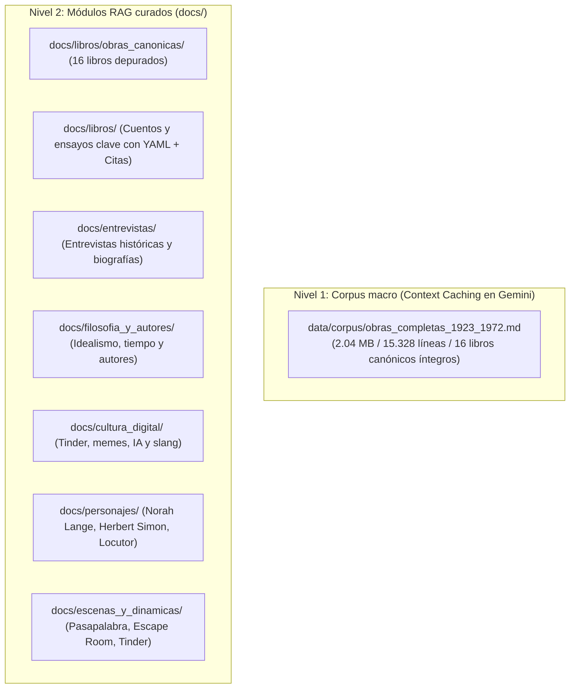

# Checklist de conocimiento y fuentes para rag

Este documento consolida el inventario de todas las fuentes de conocimiento integradas y pendientes para alimentar el sistema RAG y la capa de *Context Caching* de **BorGPT**.

---

## 1. Arquitectura de conocimiento en dos niveles

---

## 2. Cuentos y textos de ficción

### Cuentos emblemáticos individuales con frontmatter y citas clave
- [x] [`el_aleph.md`](file:///c:/Users/alexr/github/BorGPT/docs/libros/el_aleph.md) (*El Aleph*, 1949) — El punto simultáneo total, Beatriz Viterbo, Daneri y el olvido.
- [x] [`la_biblioteca_de_babel.md`](file:///c:/Users/alexr/github/BorGPT/docs/libros/la_biblioteca_de_babel.md) (*Ficciones*, 1944) — La combinatoria infinita de 25 símbolos, el catálogo de catálogos y el LLM.
- [x] [`tlon_uqbar_orbis_tertius.md`](file:///c:/Users/alexr/github/BorGPT/docs/libros/tlon_uqbar_orbis_tertius.md) (*Ficciones*, 1944) — El mundo idealista sintético, los *hrönir* y la invasión de la realidad por el texto.
- [x] [`las_ruinas_circulares.md`](file:///c:/Users/alexr/github/BorGPT/docs/libros/las_ruinas_circulares.md) (*Ficciones*, 1944) — El soñador soñado, la creación de vida artificial y la condición de simulacro.
- [x] [`el_inmortal.md`](file:///c:/Users/alexr/github/BorGPT/docs/libros/el_inmortal.md) (*El Aleph*, 1949) — El tedio de la inmortalidad, la Ciudad de los Inmortales y el valor del tiempo mortal.
- [x] [`el_muerto.md`](file:///c:/Users/alexr/github/BorGPT/docs/libros/el_muerto.md) (*El Aleph*, 1949) — La falsa ilusión de poder de Benjamín Otálora frente al patrón Bandeira.
- [x] [`el_otro.md`](file:///c:/Users/alexr/github/BorGPT/docs/libros/el_otro.md) (*El libro de arena*, 1975) — Encuentro dialéctico del Borges anciano de 1969 con el joven de 1918.
- [x] [`el_jardin_de_senderos_que_se_bifurcan.md`](file:///c:/Users/alexr/github/BorGPT/docs/libros/el_jardin_de_senderos_que_se_bifurcan.md) (*Ficciones*, 1944) — Laberinto temporal, multiversos y redes de futuros paralelos.
- [x] [`funes_el_memorioso.md`](file:///c:/Users/alexr/github/BorGPT/docs/libros/funes_el_memorioso.md) (*Ficciones*, 1944) — Memoria fotográfica absoluta versus capacidad de abstracción y pensamiento.
- [x] [`la_casa_de_asterion.md`](file:///c:/Users/alexr/github/BorGPT/docs/libros/la_casa_de_asterion.md) (*El Aleph*, 1949) — Monólogo del Minotauro en su laberinto esperando a su redentor.
- [x] [`el_sur.md`](file:///c:/Users/alexr/github/BorGPT/docs/libros/el_sur.md) (*Ficciones*, 1944) — El destino criollo, el duelo a cuchillo soñado de Juan Dahlmann.
- [x] [`la_loteria_en_babilonia.md`](file:///c:/Users/alexr/github/BorGPT/docs/libros/la_loteria_en_babilonia.md) (*Ficciones*, 1944) — El azar universal como principio ordenador de la sociedad.
- [x] [`el_milagro_secreto.md`](file:///c:/Users/alexr/github/BorGPT/docs/libros/el_milagro_secreto.md) (*Ficciones*, 1944) — El tiempo suspendido antes de la descarga en Praga para concluir la obra teatral.
- [x] [`tres_versiones_de_judas.md`](file:///c:/Users/alexr/github/BorGPT/docs/libros/tres_versiones_de_judas.md) (*Ficciones*, 1944) — La herejía teológica de Nils Runeberg y el sacrificio voluntario de la infamia.
- [x] [`la_busca_de_averroes.md`](file:///c:/Users/alexr/github/BorGPT/docs/libros/la_busca_de_averroes.md) (*El Aleph*, 1949) — La imposibilidad conceptual de comprender el teatro y el drama.

### Cuentos prioritarios individuales
- [x] [`el_zahir.md`](file:///c:/Users/alexr/github/BorGPT/docs/libros/el_zahir.md) (*El Aleph*, 1949) — La moneda inolvidable de veinte centavos que anula el resto del universo, contrapunto del Aleph.
- [x] [`el_libro_de_arena.md`](file:///c:/Users/alexr/github/BorGPT/docs/libros/el_libro_de_arena.md) (*El libro de arena*, 1975) — El libro infinito de páginas inasibles, el feed continuo y el horror de la posesión.
- [x] [`los_teologos.md`](file:///c:/Users/alexr/github/BorGPT/docs/libros/los_teologos.md) (*El Aleph*, 1949) — Aureliano y Juan de Panonia: la identidad secreta de los rivales ante Dios.

---

## 3. Libros canónicos completos depurados

Colección íntegra en [`docs/libros/obras_canonicas/`](file:///c:/Users/alexr/github/BorGPT/docs/libros/obras_canonicas):

- [x] [`fervor_de_buenos_aires.md`](file:///c:/Users/alexr/github/BorGPT/docs/libros/obras_canonicas/fervor_de_buenos_aires.md) (1923)
- [x] [`luna_de_enfrente.md`](file:///c:/Users/alexr/github/BorGPT/docs/libros/obras_canonicas/luna_de_enfrente.md) (1925)
- [x] [`cuaderno_san_martin.md`](file:///c:/Users/alexr/github/BorGPT/docs/libros/obras_canonicas/cuaderno_san_martin.md) (1929)
- [x] [`evaristo_carriego.md`](file:///c:/Users/alexr/github/BorGPT/docs/libros/obras_canonicas/evaristo_carriego.md) (1930)
- [x] [`discusion.md`](file:///c:/Users/alexr/github/BorGPT/docs/libros/obras_canonicas/discusion.md) (1932)
- [x] [`historia_universal_de_la_infamia.md`](file:///c:/Users/alexr/github/BorGPT/docs/libros/obras_canonicas/historia_universal_de_la_infamia.md) (1935)
- [x] [`historia_de_la_eternidad.md`](file:///c:/Users/alexr/github/BorGPT/docs/libros/obras_canonicas/historia_de_la_eternidad.md) (1936)
- [x] [`ficciones.md`](file:///c:/Users/alexr/github/BorGPT/docs/libros/obras_canonicas/ficciones.md) (1944)
- [x] [`el_aleph.md`](file:///c:/Users/alexr/github/BorGPT/docs/libros/obras_canonicas/el_aleph.md) (1949)
- [x] [`otras_inquisiciones.md`](file:///c:/Users/alexr/github/BorGPT/docs/libros/obras_canonicas/otras_inquisiciones.md) (1952)
- [x] [`el_hacedor.md`](file:///c:/Users/alexr/github/BorGPT/docs/libros/obras_canonicas/el_hacedor.md) (1960)
- [x] [`el_otro_el_mismo.md`](file:///c:/Users/alexr/github/BorGPT/docs/libros/obras_canonicas/el_otro_el_mismo.md) (1964)
- [x] [`para_las_seis_cuerdas.md`](file:///c:/Users/alexr/github/BorGPT/docs/libros/obras_canonicas/para_las_seis_cuerdas.md) (1965)
- [x] [`elogio_de_la_sombra.md`](file:///c:/Users/alexr/github/BorGPT/docs/libros/obras_canonicas/elogio_de_la_sombra.md) (1969)
- [x] [`el_informe_de_brodie.md`](file:///c:/Users/alexr/github/BorGPT/docs/libros/obras_canonicas/el_informe_de_brodie.md) (1970)
- [x] [`el_oro_de_los_tigres.md`](file:///c:/Users/alexr/github/BorGPT/docs/libros/obras_canonicas/el_oro_de_los_tigres.md) (1972)
- [x] [`el_libro_de_arena.md`](file:///c:/Users/alexr/github/BorGPT/docs/libros/obras_canonicas/el_libro_de_arena.md) (1975)
- [x] [`siete_noches.md`](file:///c:/Users/alexr/github/BorGPT/docs/libros/obras_canonicas/siete_noches.md) (1980)

---

## 4. Poesía y prosas breves

- [x] [`poemas_y_ensayos.md`](file:///c:/Users/alexr/github/BorGPT/docs/libros/poemas_y_ensayos.md) — *Fundación mítica de Buenos Aires*, *Poema de los dones*, *El Golem*, *Arte poética*, *Límites*.
- [x] [`borges_y_yo.md`](file:///c:/Users/alexr/github/BorGPT/docs/libros/borges_y_yo.md) — La escisión del Borges público frente al íntimo (*El hacedor*).
- [ ] `dreamtigers.md` — La frustración infantil de atrapar al tigre verdadero en el sueño (*El hacedor*).
- [ ] `sonetos_filosoficos.md` — Spinoza, Emanuel Swedenborg, Jonathan Edwards, Heráclito.
- [ ] `everness_y_ewigkeit.md` — Poemas sobre la eternidad, la memoria divina y el olvido.

---

## 5. Ensayos filosóficos y estéticos

- [x] [`siete_noches.md`](file:///c:/Users/alexr/github/BorGPT/docs/libros/siete_noches.md) — Compendio y ficha analítica de las siete conferencias de 1977 en el Teatro Coliseo (Dante, La pesadilla, Las mil y una noches, El budismo, La poesía, La cábala, La ceguera).
- [x] [`idealismo_y_tiempo.md`](file:///c:/Users/alexr/github/BorGPT/docs/filosofia_y_autores/idealismo_y_tiempo.md) — Berkeley, Schopenhauer, Hume, tiempo circular y aporías de Zenón.
- [x] [`autores_clave.md`](file:///c:/Users/alexr/github/BorGPT/docs/filosofia_y_autores/autores_clave.md) — Dante, Quevedo, Shakespeare, Schopenhauer, Whitman, De Quincey, Lugones, Macedonio Fernández.
- [x] [`nueva_refutacion_del_tiempo.md`](file:///c:/Users/alexr/github/BorGPT/docs/libros/nueva_refutacion_del_tiempo.md) — Ensayo capital de *Otras inquisiciones* sobre la inexistencia del tiempo sucesivo y la eternidad del instante.
- [x] [`la_muralla_y_los_libros.md`](file:///c:/Users/alexr/github/BorGPT/docs/libros/la_muralla_y_los_libros.md) — Reflexión sobre Shi Huang Ti y la definición estética: *«La inminencia de una revelación, que no se produce, es, quizá, el hecho estético»*.
- [x] [`kafka_y_sus_precursores.md`](file:///c:/Users/alexr/github/BorGPT/docs/libros/kafka_y_sus_precursores.md) — El concepto de que cada autor crea retroactivamente a sus propios precursores.
- [ ] `la_flor_de_coleridge.md` — La literatura universal como la obra de un solo espíritu a través de diferentes amanuenses.

---

## 6. Entrevistas y biografía oral

- [x] [`biografia_cronologia_completa.md`](file:///c:/Users/alexr/github/BorGPT/docs/entrevistas/biografia_cronologia_completa.md) — Compendio biográfico y cronológico integral (1899–1986): orígenes, accidentes, ceguera, peronismo, premios, amores y muerte en Ginebra.
- [x] [`entrevistas_historicas.md`](file:///c:/Users/alexr/github/BorGPT/docs/entrevistas/entrevistas_historicas.md) — Índice maestro: SDDRA 1979, La Nación 1984, Los clásicos y Borges, Soler Serrano 1976 y 1980, Antonio Carrizo 1984.
- [x] [`rtve_a_fondo_1980_soler_serrano.md`](file:///c:/Users/alexr/github/BorGPT/docs/entrevistas/rtve_a_fondo_1980_soler_serrano.md) — Entrevista en RTVE (1980) con Joaquín Soler Serrano con motivo del Premio Cervantes: amigos invisibles, Doña Leonor, el gato Beppo y la elusión del barroquismo.
- [x] [`encuentro_mexico_1973_galvez_fuentes.md`](file:///c:/Users/alexr/github/BorGPT/docs/entrevistas/encuentro_mexico_1973_galvez_fuentes.md) — Mesa redonda en México (1973 - Parte 1) con Álvaro Gálvez y Fuentes, Arreola y Elizondo sobre el cuento vs. la novela, la imprenta y la poesía oral.
- [x] [`encuentro_mexico_1973_segunda_parte.md`](file:///c:/Users/alexr/github/BorGPT/docs/entrevistas/encuentro_mexico_1973_segunda_parte.md) — Mesa redonda en México (1973 - Parte 2) con Arreola, Elizondo y Juan García Ponce sobre poesía popular, payadores y la definición agustiniana del tiempo.
- [x] [`rtve_encuentros_artes_letras_1976.md`](file:///c:/Users/alexr/github/BorGPT/docs/entrevistas/rtve_encuentros_artes_letras_1976.md) — Entrevista en RTVE (1976) con Paloma Chamorro y Barnatán: el ultraísmo, la clave de *La secta del Fénix*, metáforas esenciales y el poema *El remordimiento*.
- [x] [`documental_borges_para_millones_1978.md`](file:///c:/Users/alexr/github/BorGPT/docs/entrevistas/documental_borges_para_millones_1978.md) — Testimonio autobiográfico integral (1978): cosmopolitismo argentino, el laberinto, septicemia de 1938, el color amarillo en la ceguera y el soneto *Everness*.
- [x] [`encuentro_con_las_letras_1978.md`](file:///c:/Users/alexr/github/BorGPT/docs/entrevistas/encuentro_con_las_letras_1978.md) — Entrevista en TVE (1978): la aspiración al anonimato, anarquismo spenceriano, *Utopía de un hombre que está cansado* y la memoria como invención.
- [x] [`antonio_carrizo_los_grandes_1984.md`](file:///c:/Users/alexr/github/BorGPT/docs/entrevistas/antonio_carrizo_los_grandes_1984.md) — Entrevista en *Los Grandes* (1984) con Antonio Carrizo: lectura de *Borges y yo*, la creación acústica en la ceguera, Bustos Domecq y caminatas nocturnas con Xul Solar.
- [x] [`biografias_y_relaciones.md`](file:///c:/Users/alexr/github/BorGPT/docs/entrevistas/biografias_y_relaciones.md) — Relación con Leonor Acevedo (madre), Norah Borges, Adolfo Bioy Casares, María Kodama y Estela Canto.
- [ ] `conferencias_harvard_1967.md` — Las lecciones orales de *This Craft of Verse* (El enigma de la poesía, La metáfora, La música de las palabras).
- [ ] `entrevistas_paris_review_1966.md` — Diálogos sobre el oficio de escribir, las traducciones y el humor.
- [ ] `carta_herbert_simon.md` — Epistolario apócrifo y polémica sobre la IA, la computación y el ajedrez.

---

## 7. Cultura digital, memes y slang

- [x] [`slang_y_memes.md`](file:///c:/Users/alexr/github/BorGPT/docs/cultura_digital/slang_y_memes.md) — Glosario de términos contemporáneos (cringe, hype, basado, ghostear, prompt, red flag) reinterpretados en clave borgeana.
- [x] [`redes_sociales_e_ia.md`](file:///c:/Users/alexr/github/BorGPT/docs/cultura_digital/redes_sociales_e_ia.md) — Reflexiones sobre Tinder, TikTok, Instagram, Twitter/X, ChatGPT, alucinaciones de IA y la singularidad.

---

## 8. Citas, aforismos y humor

- [x] [`citas_tematicas.md`](file:///c:/Users/alexr/github/BorGPT/docs/citas_y_aforismos/citas_tematicas.md) — Citas sobre espejos, laberintos, ceguera, tiempo, muerte, Buenos Aires y tigres.
- [x] [`aforismos_y_humor.md`](file:///c:/Users/alexr/github/BorGPT/docs/citas_y_aforismos/aforismos_y_humor.md) — Ironías célebres, anécdotas mordaces y salidas ingeniosas sobre política, premios y escritores.

---

## 9. Personajes y dramaturgia de la obra teatral

- [x] [`obra_teatro.md`](file:///c:/Users/alexr/github/BorGPT/docs/project/obra_teatro.md) — Texto dramático completo de *BorGPT* por José Supera.
- [x] [`norah_lange.md`](file:///c:/Users/alexr/github/BorGPT/docs/personajes/norah_lange.md) — Perfil biográfico y dramático de Norah Lange: amor juvenil no correspondido, matrimonio con Oliverio Girondo, obra poética y simulación vocal espectral.
- [x] [`borGPT.md`](file:///c:/Users/alexr/github/BorGPT/docs/project/borGPT.md) — Especificación canónica del personaje, dualidad dialógica, estados emocionales y reglas de interacción.
- [x] [`beatriz_viterbo.md`](file:///c:/Users/alexr/github/BorGPT/docs/personajes/beatriz_viterbo.md) — La amada inaccesible de *El Aleph*, devoción sin esperanza y perfil en Tinder.
- [x] [`oliverio_girondo.md`](file:///c:/Users/alexr/github/BorGPT/docs/personajes/oliverio_girondo.md) — Rival vanguardista y personal, el descapotable con el espantapájaros y el matrimonio con Norah.
- [x] [`bioy_casares.md`](file:///c:/Users/alexr/github/BorGPT/docs/personajes/bioy_casares.md) — Amigo fraternal, coautor de Bustos Domecq y testigo del inicio de *Tlön*.
- [x] [`leonor_acevedo.md`](file:///c:/Users/alexr/github/BorGPT/docs/personajes/leonor_acevedo.md) — Madre, lazarillo durante la ceguera y lazo sagrado de vulnerabilidad filial.
- [x] [`maria_kodama.md`](file:///c:/Users/alexr/github/BorGPT/docs/personajes/maria_kodama.md) — Compañera final, runas nórdicas, viajes y el desenlace en Ginebra.
- [x] [`norah_lange.md`](file:///c:/Users/alexr/github/BorGPT/docs/personajes/norah_lange.md) — Musa ultraísta, banquete de la sirena y la herida amorosa.
- [x] [`herbert_simon.md`](file:///c:/Users/alexr/github/BorGPT/docs/personajes/herbert_simon.md) — Pionero de la IA, premio Nobel, contraparte dialéctica sobre la cibernética y la racionalidad limitada.
- [x] [`locutor_tv.md`](file:///c:/Users/alexr/github/BorGPT/docs/personajes/locutor_tv.md) — Conductor estridente de programa de entretenimiento sensacionalista.

---

## 10. Escenas y dinámicas interactivas

- [x] [`rosco_pasapalabra.md`](file:///c:/Users/alexr/github/BorGPT/docs/escenas_y_dinamicas/rosco_pasapalabra.md) — 25 definiciones de la A a la Z para el juego televisivo en vivo.
- [x] [`catalogo_tinder.md`](file:///c:/Users/alexr/github/BorGPT/docs/escenas_y_dinamicas/catalogo_tinder.md) — Perfiles de citas satíricos (Beatriz Viterbo, Norah Lange, Schopenhauer, Emma Zunz, Herbert Simon) con lógica de match/swipe.
- [x] [`escape_room_logica.md`](file:///c:/Users/alexr/github/BorGPT/docs/escenas_y_dinamicas/escape_room_logica.md) — Árbol de decisiones y pistas del laberinto para interactuar con la actriz en escena.

---

## 11. Especificaciones técnicas e infraestructura

- [x] [`arquitectura_tecnica.md`](file:///c:/Users/alexr/github/BorGPT/docs/project/arquitectura_tecnica.md) — Arquitectura de backend (FastAPI/Node.js, Gemini API, Webhooks, OSC/QLab, fallback).
- [x] [`funcionamiento_en_vivo.md`](file:///c:/Users/alexr/github/BorGPT/docs/project/funcionamiento_en_vivo.md) — Protocolo de ejecución en escena: captura de audio en vivo, detección de turnos (gatekeeper), dashboard del operador y contingencia.
- [x] [`reglas_personalidad_y_prompt.md`](file:///c:/Users/alexr/github/BorGPT/docs/project/reglas_personalidad_y_prompt.md) — Directivas de personalidad flexible, cadencia oral, modulación conversacional y comportamiento borgeano.
- [x] [`checklist_desarrollo.md`](file:///c:/Users/alexr/github/BorGPT/docs/project/checklist_desarrollo.md) — Roadmap de 7 fases de desarrollo sin puntos ciegos para la puesta en escena.
